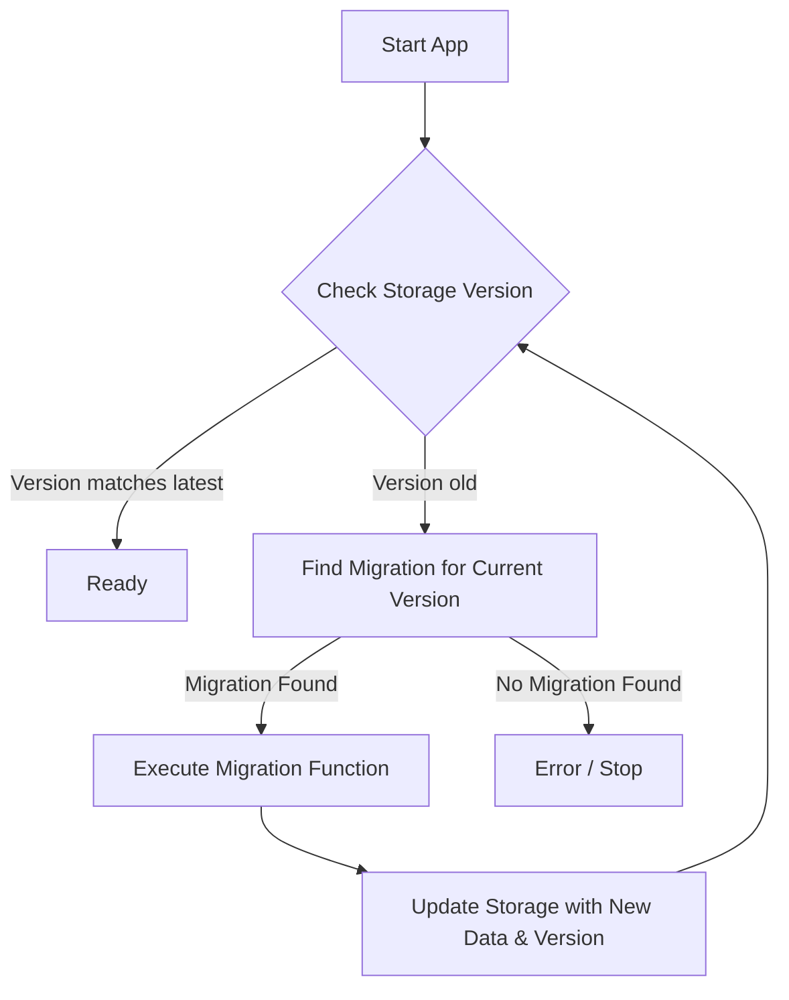

# Migration System Design Document

## Overview

The migration system handles data schema evolution for the extension's persistent storage. It ensures that user data stored in older formats is seamlessly transformed to match the application's current schema requirements.

## Architecture

### Core Components

1.  **Version Control (`ESchemeVersion`)**:
    *   **File**: `src/migrations/scheme-version.enum.ts`
    *   **Purpose**: Defines a strictly ordered set of schema versions (e.g., `SYNC_0_0_0`, `SYNC_1_0_0`).
    *   **Usage**: Used as keys in the migration map and as values in the stored data's `version` field.

2.  **Migration Engine (`migrateStorage`)**:
    *   **File**: `src/migrations/core.ts`
    *   **Purpose**: The central runner that orchestrates the migration process.
    *   **Mechanism**:
        *   Retrieves current data from storage.
        *   Identifies the current version (defaults to `0.0.0`).
        *   Iteratively looks up and executes migration functions from the registered map.
        *   Persists the result after each successful migration step (transaction-like safety per step).

3.  **Migration Definition (`IMigration`)**:
    *   **File**: `src/migrations/types.ts`
    *   **Structure**: A map where keys are *source* versions and values are functions that transform data to the *target* version.
    *   **Signature**: `(data: IInputData) => IInputData`

### Data Flow

## Detailed Workflows

### 1. Initialization
The application initializes migrations via `migrateScheme()` in `src/migrations/index.ts`. This entry point aggregates specific migration strategies (currently only `sync`) and invokes the core engine.

### 2. Migration Execution
For a user starting with version `0.0.0` who needs to reach `1.0.1`:

1.  **Step 1**: Engine reads data, sees `version: "0.0.0"`.
2.  **Lookup**: Finds migration registered for key `0.0.0` (e.g., `migrateSyncTo_1_0_0`).
3.  **Transform**: Executes function. Data structure changes, `version` becomes `1.0.0`.
4.  **Save**: New data is saved to storage.
5.  **Loop**: Engine sees `version: "1.0.0"`.
6.  **Lookup**: Finds migration for key `1.0.0` (e.g., `migrateSyncTo_1_0_1`).
7.  **Transform**: Executes function. Data structure changes, `version` becomes `1.0.1`.
8.  **Save**: New data is saved.
9.  **Loop**: Engine sees `version: "1.0.1"`.
10. **Lookup**: No migration found for `1.0.1`.
11. **Finish**: Process completes.

## Extension Points

### Adding a New Version
1.  Add entry to `ESchemeVersion` enum.
2.  Implement a migration function in a new file (e.g., `src/migrations/sync/x_y_z.ts`).
3.  Register the function in `migrationSyncs` map in `src/migrations/sync/index.ts`.

### Supporting Local Storage
The `core.ts` file has a placeholder for `local` storage type. To implement:
1.  Define `Local` storage wrapper (similar to `StorageSync`).
2.  Implement efficient `get/set` (or `set` only if `get` is shared).
3.  Add logic in `migrateStorage` to handle `type === "local"`.

## Constraints & Considerations

*   **Sequential Execution**: Migrations run one by one. This is safer but potentially slower for large jumps in versions.
*   **Memory Usage**: The entire data object is loaded into memory. For extremely large datasets, a streaming or chunked approach might be needed in the future.
*   **Error Handling**: Currently, if a migration fails, the loop breaks, potentially leaving data in an intermediate state (though the version would reflect that). Robust error logging and fallback strategies could be added.
