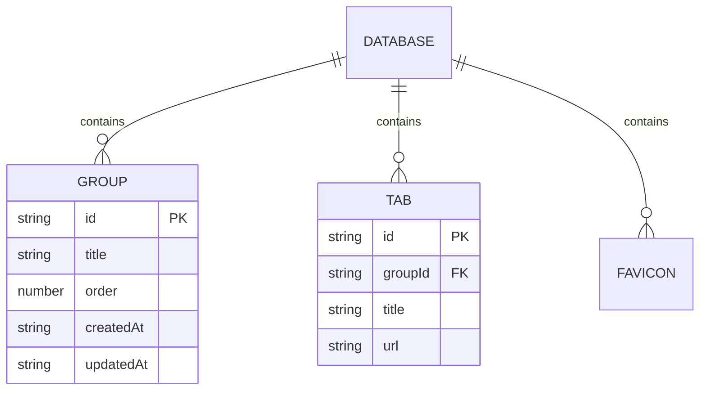

# Storage System Design Document

## Overview

The storage module handles all persistence logic for the extension, primarily using the `chrome.storage.sync` API. It maps logical entities (Groups, Tabs, FavIcons) to the underlying storage schema and provides typed access patterns.

## Architecture

### Components

1.  **Schema Definitions (`index.d.ts`)**:
    *   Defines the `NStorage` namespace.
    *   **`Schema.Database`**: The root object stored in Chrome sync storage.
        *   `version`: String (managed by migrations).
        *   `groups`: Array of `Group` objects.
        *   `tabs`: Array of `Tab` objects (normalized, linked via `groupId`).
        *   `favIcons`: Dictionary of favicon URLs.

2.  **Core Adapter (`core.ts`)**:
    *   `StorageSync`: A static class wrapping `chrome.storage.sync`.
    *   Provides typed `get<T>` and `set<T>` methods.
    *   Acts as the raw data access layer.

3.  **Entity Repositories**:
    *   **`group.sync.ts` (`StorageSyncGroup`)**: Manages `groups`. Includes logic to join tabs with groups (`getListWithTabs`).
    *   **`tab.sync.ts` (`StorageSyncTab`)**: Manages `tabs` list.
    *   **`favIcon.sync.ts` (`StorageSyncFavIcon`)**: Manages the `favIcons` dictionary.

### Data Model

The data is stored in a semi-normalized relational structure within a single JSON-like object (limited by Chrome Sync quotas).



*Note: Tabs reference Groups via `groupId`. The `StorageSyncGroup.getListWithTabs()` method performs the "JOIN" operation in memory.*

## Usage Patterns

### Reading Data
Data is typically read per-entity or joined for UI views.

```typescript
// Get raw groups
const groups = await StorageSyncGroup.getList();

// Get groups populated with their tabs (ViewModel)
const groupsWithTabs = await StorageSyncGroup.getListWithTabs();
```

### Writing Data
Writes are performed by fetching the entire list for an entity, modifying it in memory, and writing it back.

> **⚠️ Concurrency Warning**: The current implementation uses a "Read-Modify-Write" pattern without locking. If two asynchronous operations attempt to update the same entity list simultaneously, the last write will win, potentially overwriting changes from the first.

```typescript
// Update a group
await StorageSyncGroup.update({ id: "123", title: "New Title" });
// 1. StorageSyncGroup.getList() -> fetches all groups
// 2. Finds and updates "123" in memory
// 3. StorageSync.set({ groups: [...] }) -> overwrites 'groups' key
```

## Constraints

1.  **Quota Limits**: `chrome.storage.sync` has strict limits (100KB total, 8KB per item). Storing large numbers of tabs or large favicons (if not careful with URLs) can hit these limits.
2.  **Rate Limiting**: Chrome limits the number of write operations per minute. The application should debounce rapid updates.
3.  **Sync Latency**: Changes made on one device may take time to propagate to others. The app listens for `chrome.storage.onChanged` (though listeners are defined elsewhere, likely in `src/listeners`).

## Future Improvements

*   **Transactional Writes**: Implement a mutex or queue system to prevent race conditions during updates.
*   **Compression**: If quotas become an issue, compress data before storage.
*   **Local Fallback**: Implement `StorageLocal` for data that doesn't need syncing or exceeds sync quotas.
